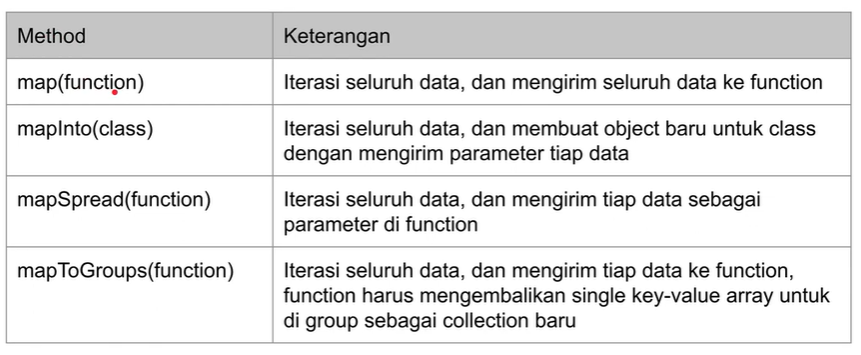

# LARAVEL BLADE TEMPLATE

## POINT UTAMA

### 1. Instalasi

-   Minimal PHP versi 8 atau lebih,

-   Composer versi 2 atau lebih,

-   Lalu pada cmd ketikan `composer create-project laravel/laravel=v10.0.3 belajar-laravel-collection`.

---

### 2. Membuat Collection

-   Untuk membuat `collection`, laravel sudah menyediakan global function `collect(array)` yang digunakan untuk merubah tipe data array

-   Kode laravel `collection`

    ```PHP
     public function testCreateCollection()
    {
        $collection = collect([1, 2, 3]);
        $this->assertEqualsCanonicalizing([1, 2, 3], $collection->all());
    }
    ```

---

### 3. for Each

-   `Collection` adalah struktur data turunan dari itearble PHP,

-   Dengan demikian, kita bisa melakukan iterasi(operasi berulang) data `collection` menggunakan perintah for PHP

-   Kode for each

    ```PHP
    public function testForEach()
    {
        $collection = collect([1, 2, 3, 4, 5, 6, 7, 8, 9]);
        foreach ($collection as $key => $value) {
            $this->assertEquals($key + 1, $value);
        }
    }
    ```

---

### 4. Manipulasi Collection

-   Kita bisa memanipulasi data menggunakan method yang terdapat di class `collection`

-   `Collection` operations

    

-   Kode manipulasi `collection`

    ```PHP
    public function testCrud()
    {
        $collection = collect([]);
        $collection->push(1, 2, 3);
        $this->assertEqualsCanonicalizing([1, 2, 3], $collection->all());

        $result = $collection->pop();
        $this->assertEquals(3, $result);
        $this->assertEqualsCanonicalizing([1, 2], $collection->all());
    }
    ```

---

### 5. Mapping

-   Mapping adalah transformasi(mengubah bentuk data) menjadi data lain,

-   Mapping membutuhkan _function_ sebagai parameter yang digunakan untuk membentuk data lainnya.

-   Mapping opetations

    

-   Kode mapping

    ```PHP
    <?php

    namespace App\Data;

    class Person
    {

        var string $name;

        public function __construct(string $name){
            $this->name = $name;
        }
    }
    ```

-   Unit test mapping

    ```PHP
    public function testMapInto()
    {
        $collection = collect(["Gusti"]);
        $result = $collection->mapInto(Person::class);
        $this->assertEquals([new Person("Gusti")], $result->all());
    }
    ```

-   Kode mapping group

    ```PHP
     public function testMapToGroups()
    {
        $collection = collect([
            [
                "name" => "Gusti",
                "department" => "IT"
            ],
            [
                "name" => "Kiana",
                "department" => "IT"
            ],
            [
                "name" => "Elaina",
                "department" => "HR"
            ]
        ]);
     $result = $collection->mapToGroups(function ($person) {
            return [
                $person["department"] => $person["name"]
            ];
        });
    }
    ```

---

### 6. Zipping

-   Zipping adalah transformasi yang digunakan untuk menggabungkan dua buah `collection`.

-   Zipping operations

    

-   Kode zipping

    ```PHP
    public function testZip()
    {
        $collection1 = collect([1, 2, 3]);
        $collection2 = collect([4, 5, 6]);
        $collection3 = $collection1->zip($collection2);

        $this->assertEquals([
            collect([1, 4]),
            collect([2, 5]),
            collect([3, 6]),
        ], $collection3->all());
    }
    ```

---

### 7. Flattening

-   Flattening adalah operasi transformasi untuk _nested_ `collection` menjadi flat

-   Flattening operations

    ```PHP
    public function testCollapse()
    {
        $collection = collect([
            [1, 2, 3],
            [4, 5, 6],
            [7, 8, 9]
        ]);
        $result = $collection->collapse();
        $this->assertEqualsCanonicalizing([1, 2, 3, 4, 5, 6, 7, 8, 9], $result->all());

    }
    ```

-   Kode flat map

    ```PHP
    public function testFlatMap()
    {
        $collection = collect([
            [
                "name" => "Gusti",
                "hobbies" => ["Coding", "Gaming"]
            ],
            [
                "name" => "Kiana",
                "hobbies" => ["Reading", "Writing"]
            ],
        ]);
        $result = $collection->flatMap(function ($item) {
            $hobbies = $item["hobbies"];
            return $hobbies;
        });

        $this->assertEqualsCanonicalizing(["Coding", "Gaming", "Reading", "Writing"], $result->all());
    }
    ```

---

### 8. String Representation

-   String Representation adalah operasi transformasi untuk mengubah `collection` menjadi _string_.

-   String Representation operations

    

-   Kode String Representation

    ```PHP
     public function testStringRepresentation()
    {
        $collection = collect(["Gusti", "Alifiraqsha", "Akbar"]);

        $this->assertEquals("Gusti-Alifiraqsha-Akbar", $collection->join("-"));
        $this->assertEquals("Gusti-Alifiraqsha_Akbar", $collection->join("-", "_"));
        $this->assertEquals("Gusti, Alifiraqsha and Akbar", $collection->join(", ", " and "));
    }
    ```

---

### 9. Filtering

-   Filtering membutuhkan _function_ sebagai parameter,

-   Filtering dalam Laravel digunakan untuk membatasi data berdasarkan kriteria tertentu. Dalam konteks Laravel, ini sering kali melibatkan penggunaan _Query Builder_ atau _Eloquent ORM_ untuk membuat query yang mencari data yang memenuhi kriteria yang ditetapkan.

-   Filtering operations

    

-   Kode filtering

    ```PHP
    public function testFilter()
    {
        $collection = collect([
            "Gusti" => 100,
            "Kiana" => 80,
            "Elaina" => 90
        ]);

        $result = $collection->filter(function ($value, $key) {
            return $value >= 90;
        });

        $this->assertEquals([
            "Gusti" => 100,
            "Elaina" => 90
        ], $result->all());
    }
    ```

---

### 10. Partitioning

-   Denagn partitioning kita bisa mendapatkan dua `collection` yang terdiri dari `collection` yang masuk dan tidak masuk filter.

-   Partitionig operations

    

-   Kode partition

    ```PHP
    public function testPartition()
    {
        $collection = collect([
            "Gusti" => 100,
            "Kiana" => 80,
            "Elaina" => 90
        ]);

        [$result1, $result2] = $collection->partition(function ($value, $key) {
            return $value >= 90;
        });

        $this->assertEquals([
            "Gusti" => 100,
            "Elaina" => 90
        ], $result1->all());
        $this->assertEquals([
            "Kiana" => 80
        ], $result2->all());
    }

    ```

---

## PERTANYAAN & CATATAN TAMBAHAN

-   Laravel collections adalah sekumpulan method yang kuat dan mudah digunakan untuk bekerja dengan array dan data lainnya.

---

### KESIMPULAN

-
