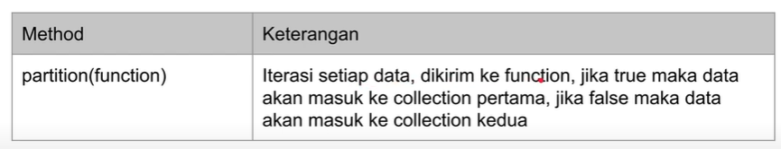
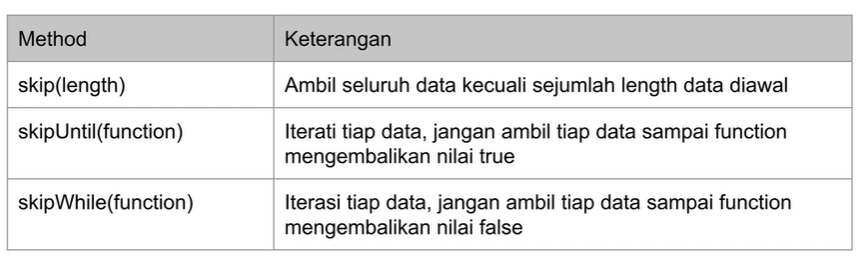
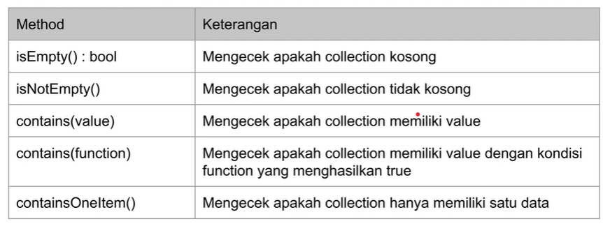
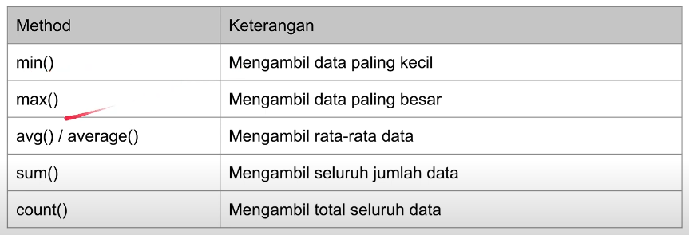

# LARAVEL BLADE TEMPLATE

## POINT UTAMA

### 1. Instalasi

-   Minimal PHP versi 8 atau lebih,

-   Composer versi 2 atau lebih,

-   Lalu pada cmd ketikan `composer create-project laravel/laravel=v10.0.3 belajar-laravel-collection`.

---

### 2. Membuat Collection

-   Untuk membuat `collection`, laravel sudah menyediakan global function `collect(array)` yang digunakan untuk merubah tipe data array

-   Kode laravel `collection`

    ```PHP
     public function testCreateCollection()
    {
        $collection = collect([1, 2, 3]);
        $this->assertEqualsCanonicalizing([1, 2, 3], $collection->all());
    }
    ```

---

### 3. For Each

-   `Collection` adalah struktur data turunan dari itearble PHP,

-   Dengan demikian, kita bisa melakukan iterasi(operasi berulang) data `collection` menggunakan perintah for PHP

-   Kode for each

    ```PHP
    public function testForEach()
    {
        $collection = collect([1, 2, 3, 4, 5, 6, 7, 8, 9]);
        foreach ($collection as $key => $value) {
            $this->assertEquals($key + 1, $value);
        }
    }
    ```

---

### 4. Manipulasi Collection

-   Kita bisa memanipulasi data menggunakan method yang terdapat di class `collection`

-   `Collection` operations

    

-   Kode manipulasi `collection`

    ```PHP
    public function testCrud()
    {
        $collection = collect([]);
        $collection->push(1, 2, 3);
        $this->assertEqualsCanonicalizing([1, 2, 3], $collection->all());

        $result = $collection->pop();
        $this->assertEquals(3, $result);
        $this->assertEqualsCanonicalizing([1, 2], $collection->all());
    }
    ```

---

### 5. Mapping

-   Mapping adalah transformasi(mengubah bentuk data) menjadi data lain,

-   Mapping membutuhkan _function_ sebagai parameter yang digunakan untuk membentuk data lainnya.

-   Mapping opetations

    

-   Kode mapping

    ```PHP
    <?php

    namespace App\Data;

    class Person
    {

        var string $name;

        public function __construct(string $name){
            $this->name = $name;
        }
    }
    ```

-   Unit test mapping

    ```PHP
    public function testMapInto()
    {
        $collection = collect(["Gusti"]);
        $result = $collection->mapInto(Person::class);
        $this->assertEquals([new Person("Gusti")], $result->all());
    }
    ```

-   Kode mapping group

    ```PHP
     public function testMapToGroups()
    {
        $collection = collect([
            [
                "name" => "Gusti",
                "department" => "IT"
            ],
            [
                "name" => "Kiana",
                "department" => "IT"
            ],
            [
                "name" => "Elaina",
                "department" => "HR"
            ]
        ]);
     $result = $collection->mapToGroups(function ($person) {
            return [
                $person["department"] => $person["name"]
            ];
        });
    }
    ```

---

### 6. Zipping

-   Zipping adalah transformasi yang digunakan untuk menggabungkan dua buah `collection`.

-   Zipping operations

    

-   Kode zipping

    ```PHP
    public function testZip()
    {
        $collection1 = collect([1, 2, 3]);
        $collection2 = collect([4, 5, 6]);
        $collection3 = $collection1->zip($collection2);

        $this->assertEquals([
            collect([1, 4]),
            collect([2, 5]),
            collect([3, 6]),
        ], $collection3->all());
    }
    ```

---

### 7. Flattening

-   Flattening adalah operasi transformasi untuk _nested_ `collection` menjadi flat

-   Flattening operations

    ```PHP
    public function testCollapse()
    {
        $collection = collect([
            [1, 2, 3],
            [4, 5, 6],
            [7, 8, 9]
        ]);
        $result = $collection->collapse();
        $this->assertEqualsCanonicalizing([1, 2, 3, 4, 5, 6, 7, 8, 9], $result->all());

    }
    ```

-   Kode flat map

    ```PHP
    public function testFlatMap()
    {
        $collection = collect([
            [
                "name" => "Gusti",
                "hobbies" => ["Coding", "Gaming"]
            ],
            [
                "name" => "Kiana",
                "hobbies" => ["Reading", "Writing"]
            ],
        ]);
        $result = $collection->flatMap(function ($item) {
            $hobbies = $item["hobbies"];
            return $hobbies;
        });

        $this->assertEqualsCanonicalizing(["Coding", "Gaming", "Reading", "Writing"], $result->all());
    }
    ```

---

### 8. String Representation

-   String Representation adalah operasi transformasi untuk mengubah `collection` menjadi _string_.

-   String Representation operations

    

-   Kode String Representation

    ```PHP
     public function testStringRepresentation()
    {
        $collection = collect(["Gusti", "Alifiraqsha", "Akbar"]);

        $this->assertEquals("Gusti-Alifiraqsha-Akbar", $collection->join("-"));
        $this->assertEquals("Gusti-Alifiraqsha_Akbar", $collection->join("-", "_"));
        $this->assertEquals("Gusti, Alifiraqsha and Akbar", $collection->join(", ", " and "));
    }
    ```

---

### 9. Filtering

-   Filtering membutuhkan _function_ sebagai parameter,

-   Filtering dalam Laravel digunakan untuk membatasi data berdasarkan kriteria tertentu. Dalam konteks Laravel, ini sering kali melibatkan penggunaan _Query Builder_ atau _Eloquent ORM_ untuk membuat query yang mencari data yang memenuhi kriteria yang ditetapkan.

-   Filtering operations

    

-   Kode filtering

    ```PHP
    public function testFilter()
    {
        $collection = collect([
            "Gusti" => 100,
            "Kiana" => 80,
            "Elaina" => 90
        ]);

        $result = $collection->filter(function ($value, $key) {
            return $value >= 90;
        });

        $this->assertEquals([
            "Gusti" => 100,
            "Elaina" => 90
        ], $result->all());
    }
    ```

---

### 10. Partitioning

-   Denagn partitioning kita bisa mendapatkan dua `collection` yang terdiri dari `collection` yang masuk dan tidak masuk filter.

-   Partitionig operations

    

-   Kode partition

    ```PHP
    public function testPartition()
    {
        $collection = collect([
            "Gusti" => 100,
            "Kiana" => 80,
            "Elaina" => 90
        ]);

        [$result1, $result2] = $collection->partition(function ($value, $key) {
            return $value >= 90;
        });

        $this->assertEquals([
            "Gusti" => 100,
            "Elaina" => 90
        ], $result1->all());
        $this->assertEquals([
            "Kiana" => 80
        ], $result2->all());
    }
    ```

---

### 11. Testing

-   Testing adalah operasi untuk mengecek isi data `collection`,

-   Hasil dari testing adalah _boolean_, dimana _true_ jika sesuai kondisi dan _false_ jika tidak sesuai kondisi.

-   Testing operations

    

-   Kode testing

    ```PHP
    public function testTesting()
    {
        $collection = collect(["Gusti", "Alifiraqsha", "Akbar"]);
        $this->assertTrue($collection->contains("Gusti"));
        $this->assertTrue($collection->contains(function ($value, $key) {
            return $value == "Akbar";
        }));
    }
    ```

---

### 12. Grouping

-   Grouping adalah operasi untuk menggabungkan (grouping) kan element-element yang ada di `coleection`.

-   Grouping operations

    

-   Kode grouping

    ```PHP
    public function testGrouping()
    {
        $collection = collect([
            [
                "name" => "Gusti",
                "department" => "IT"
            ],
            [
                "name" => "Kiana",
                "department" => "IT"
            ],
            [
                "name" => "Elaina",
                "department" => "HR"
            ]
        ]);

        $result = $collection->groupBy("department");

        assertEquals([
            "IT" => collect([
                [
                    "name" => "Gusti",
                    "department" => "IT"
                ],
                [
                    "name" => "Kiana",
                    "department" => "IT"
                ]
            ]),
            "HR" => collect([
                [
                    "name" => "Elaina",
                    "department" => "HR"
                ]
            ])
        ], $result->all());

        $result = $collection->groupBy(function ($value, $key) {
            return strtolower($value["department"]);
        });

        assertEquals([
            "it" => collect([
                [
                    "name" => "Gusti",
                    "department" => "IT"
                ],
                [
                    "name" => "Kiana",
                    "department" => "IT"
                ]
            ]),
            "hr" => collect([
                [
                    "name" => "Elaina",
                    "department" => "HR"
                ]
            ])
        ], $result->all());
    }
    ```

---

### 13. Slicing

-   Slicing adalah operasi untuk mengambil sebagian data di `collection`.

-   Slicing operations

    

-   Kode slicing

    ```PHP
    public function testSlicing()
    {
        $collection = collect([1, 2, 3, 4, 5, 6, 7, 8, 9]);
        $result = $collection->slice(3); // mulai mengambil dari data yang ke 3 sampai ke 9

        $this->assertEqualsCanonicalizing([4, 5, 6, 7, 8, 9], $result->all());

        $result = $collection->slice(3, 2); // megambil data dari yang ke 3, tapi hanya 2 data ke belakang
        $this->assertEqualsCanonicalizing([4, 5], $result->all());
    }
    ```

---

### 14. Take & Skip

-   Selain menggunakan slicing, bisa juga menggunakan opearsi take & skip unutk mengambil sebagina data.

-   Take operations

    

-   Kode take

    ```PHP
    public function testTake()
    {
        $collection = collect([1, 2, 3, 1, 2, 3, 1, 2, 3]);

        $result = $collection->take(3);
        $this->assertEqualsCanonicalizing([1, 2, 3], $result->all());

        $result = $collection->takeUntil(function ($value, $key) {
            return $value == 3;
        });
        $this->assertEqualsCanonicalizing([1, 2], $result->all());

        $result = $collection->takeWhile(function ($value, $key) {
            return $value < 3;
        });
        $this->assertEqualsCanonicalizing([1, 2], $result->all());
    }
    ```

-   Skip operations

    

-   Kode skip

    ```PHP
    public function testSkip()
    {
        $collection = collect([1, 2, 3, 4, 5, 6, 7, 8, 9]);

        $result = $collection->skip(3);
        $this->assertEqualsCanonicalizing([4, 5, 6, 7, 8, 9], $result->all());

        $result = $collection->skipUntil(function ($value, $key) {
            return $value == 3;
        });
        $this->assertEqualsCanonicalizing([3, 4, 5, 6, 7, 8, 9], $result->all());

        $result = $collection->skipWhile(function ($value, $key) {
            return $value < 3;
        });
        $this->assertEqualsCanonicalizing([3, 4, 5, 6, 7, 8, 9], $result->all());
    }
    ```

---

### 15. Chuncked

-   Chunked adalah operasi untuk memotong `collection` menjadi beberapa `collection`

-   Chunked operations

    

-   Kode chuncked

    ```PHP
    public function testChunk()
    {
        $collection = collect([1, 2, 3, 4, 5, 6, 7, 8, 9, 10]);

        $result = $collection->chunk(3);

        $this->assertEqualsCanonicalizing([1, 2, 3], $result->all()[0]->all());
        $this->assertEqualsCanonicalizing([4, 5, 6], $result->all()[1]->all());
        $this->assertEqualsCanonicalizing([7, 8, 9], $result->all()[2]->all());
        $this->assertEqualsCanonicalizing([10], $result->all()[3]->all());
    }
    ```

---

### 16. Retrive

-   Retrive adalah operasi untuk mengambil data di `collection`, ada dua operasi yaitu first & last.

-   First operations

    

-   Kode dengan first

    ```PHP
     public function testFirst()
    {
        $collection = collect([1, 2, 3, 4, 5, 6, 7, 8, 9]);
        $result = $collection->first();
        $this->assertEquals(1, $result);

        $result = $collection->first(function ($value, $key) {
            return $value > 5;
        });
        $this->assertEquals(6, $result);
    }
    ```

-   Last operations

    

-   Kode dengan last

    ```PHP
     public function testLast()
    {

        $collection = collect([1, 2, 3, 4, 5, 6, 7, 8, 9]);
        $result = $collection->last();
        $this->assertEquals(9, $result);

        $result = $collection->last(function ($value, $key) {
            return $value < 5;
        });
        $this->assertEquals(4, $result);
    }
    ```

---

### 17. Random

-   Random adalah operasi untuk mengambil data di collection dengan posisi random atau acak.

-   Random operations

    

-   Kode random

    ```PHP
    public function testRandom()
    {
        $collection = collect([1, 2, 3, 4, 5, 6, 7, 8, 9]);
        $result = $collection->random();

        $this->assertTrue(in_array($result, [1, 2, 3, 4, 5, 6, 7, 8, 9]));

        $result = $collection->random(5);
        $this->assertEqualsCanonicalizing([1,2,3,4,5], $result->all());
    }
    ```

---

### 18. Checking Existence

-   Checking existence merupaka operasi untuk mengecek apakah terdapat data yang dicari di `collection`.

-   Checking existence operations

    

-   Kode checking

    ```PHP
    public function testCheckingExistence()
    {
        $collection = collect([1, 2, 3, 4, 5, 6, 7, 8, 9]);
        $this->assertTrue($collection->isNotEmpty());
        $this->assertFalse($collection->isEmpty());
        $this->assertTrue($collection->contains(1));
        $this->assertFalse($collection->contains(10));
        $this->assertTrue($collection->contains(function ($value, $key) {
            return $value == 8;
        }));
    }
    ```

---

### 19. Ordering

-   Ordering adalah operasi untuk melakukan pengurutan data di `conllection`.

-   Ordering operations

    

-   Kode ordering

    ```PHP
    public function testOrdering()
    {
        $collection = collect([1, 3, 2, 4, 6, 5, 8, 7, 9]);
        $result = $collection->sort();
        $this->assertEqualsCanonicalizing([1, 2, 3, 4, 5, 6, 7, 8, 9], $result->all());

        $result = $collection->sortDesc();
        $this->assertEqualsCanonicalizing([9, 8, 7, 6, 5, 4, 3, 2, 1], $result->all());
    }
    ```

---

### 20. Aggregate

-   Aggregate di Laravel digunakan untuk melakukan operasi agregasi pada data dalam database.

-   Operasi agregasi adalah operasi yang melibatkan pengumpulan nilai-nilai dari beberapa baris data dan menghasilkan satu nilai hasil, seperti menghitung jumlah, rata-rata, nilai maksimum, atau nilai minimum dari sebuah kolom dalam tabel.

-   Aggregate operations

    

-   Kode aggregate

    ```PHP
      public function testAggregate()
    {
        $collection = collect([1, 2, 3, 4, 5, 6, 7, 8, 9]);
        $result = $collection->sum();
        $this->assertEquals(45, $result);

        $result = $collection->avg();
        $this->assertEquals(5, $result);

        $result = $collection->min();
        $this->assertEquals(1, $result);

        $result = $collection->max();
        $this->assertEquals(9, $result);
    }
    ```

---

### 21. Reduce

-   Reduce merupakan operasi yang dilakukan pada setiap data yang ada di `collection` secara sequential dan mengembalikan hasil,

-   Cara membuat aggregate secara manula bisa menggunakan reduce,

-   Hasil dari reduce sebelumnya akan digunakan di itersi selanjutnya.

-   Reduce operations

    

-   Kode reduce

    ```PHP
    public function testReduce()
    {
        $collection = collect([1, 2, 3, 4, 5, 6, 7, 8, 9]);
        $result = $collection->reduce(function ($carry, $item) {
            return $carry + $item;
        });
        $this->assertEquals(45, $result);

        // reduce(1,2) = 3
        // reduce(3,3) = 6
        // reduce(6,4) = 10
        // reduce(10,5) = 15
        // reduce(15,6) = 21
        // reduce(21,7) = 28
    }
    ```

---

### 22. Lazy Collection

-   Keuntungan membuat lazy collection adalah kita bisa melakukan manipulasi data besar, tanpa takut semua operasi dieksekusi sebelum dibutuhkan.

-   Saat membuat lazy collection kita harus menggunakan PHP generator.

-   Kode lazy

    ```PHP
    public function testLazyCollection()
    {

        $collection = LazyCollection::make(function () {
            $value = 0;

            while (true) {
                yield $value;
                $value++;
            }
        });

        $result = $collection->take(10);
        $this->assertEqualsCanonicalizing([0, 1, 2, 3, 4, 5, 6, 7, 8, 9], $result->all());
    }
    ```

---

## PERTANYAAN & CATATAN TAMBAHAN

-   Laravel collections adalah sekumpulan method yang kuat dan mudah digunakan untuk bekerja dengan array dan data lainnya.

---

### KESIMPULAN

-
